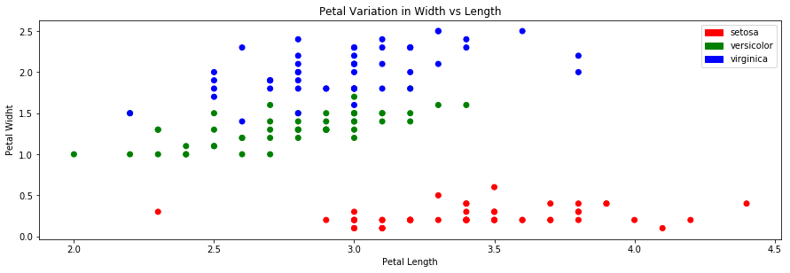
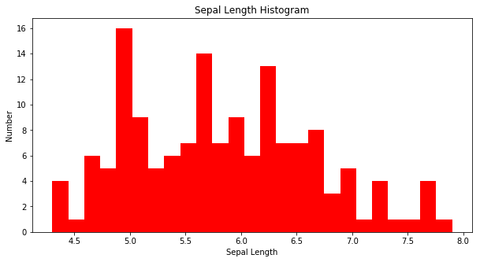

```python
# Importing the library 
import numpy as np
import pandas as pd
import matplotlib.pyplot as plt
import matplotlib.patches as mp

%matplotlib inline
```

# Task 1: 
**Load the iris_dataset in your program in a python dataframe. View the First 5 and Last 3 row items of that dataframe.**


```python
#Reading The Datafram
df = pd.read_csv('iris.csv')
```


```python
# Showning the first 5
df.head(5)
```


<div>

<table border="1" class="dataframe">
  <thead>
    <tr style="text-align: right;">
      <th></th>
      <th>sepal_length</th>
      <th>sepal_width</th>
      <th>petal_length</th>
      <th>petal_width</th>
      <th>species</th>
    </tr>
  </thead>
  <tbody>
    <tr>
      <th>0</th>
      <td>5.1</td>
      <td>3.5</td>
      <td>1.4</td>
      <td>0.2</td>
      <td>setosa</td>
    </tr>
    <tr>
      <th>1</th>
      <td>4.9</td>
      <td>3.0</td>
      <td>1.4</td>
      <td>0.2</td>
      <td>setosa</td>
    </tr>
    <tr>
      <th>2</th>
      <td>4.7</td>
      <td>3.2</td>
      <td>1.3</td>
      <td>0.2</td>
      <td>setosa</td>
    </tr>
    <tr>
      <th>3</th>
      <td>4.6</td>
      <td>3.1</td>
      <td>1.5</td>
      <td>0.2</td>
      <td>setosa</td>
    </tr>
    <tr>
      <th>4</th>
      <td>5.0</td>
      <td>3.6</td>
      <td>1.4</td>
      <td>0.2</td>
      <td>setosa</td>
    </tr>
  </tbody>
</table>
</div>


```python
# Showning the last 3
df.tail(3)
```


<div>
<table border="1" class="dataframe">
  <thead>
    <tr style="text-align: right;">
      <th></th>
      <th>sepal_length</th>
      <th>sepal_width</th>
      <th>petal_length</th>
      <th>petal_width</th>
      <th>species</th>
    </tr>
  </thead>
  <tbody>
    <tr>
      <th>147</th>
      <td>6.5</td>
      <td>3.0</td>
      <td>5.2</td>
      <td>2.0</td>
      <td>virginica</td>
    </tr>
    <tr>
      <th>148</th>
      <td>6.2</td>
      <td>3.4</td>
      <td>5.4</td>
      <td>2.3</td>
      <td>virginica</td>
    </tr>
    <tr>
      <th>149</th>
      <td>5.9</td>
      <td>3.0</td>
      <td>5.1</td>
      <td>1.8</td>
      <td>virginica</td>
    </tr>
  </tbody>
</table>
</div>


# Task 2: 
**Show the data items in a sorted manner, sorted by 'Petal Length'.**


```python
# Sorting by Petal Length and showing the first 5
df.sort_values('petal_length').head()
```


<div>

<table border="1" class="dataframe">
  <thead>
    <tr style="text-align: right;">
      <th></th>
      <th>sepal_length</th>
      <th>sepal_width</th>
      <th>petal_length</th>
      <th>petal_width</th>
      <th>species</th>
    </tr>
  </thead>
  <tbody>
    <tr>
      <th>22</th>
      <td>4.6</td>
      <td>3.6</td>
      <td>1.0</td>
      <td>0.2</td>
      <td>setosa</td>
    </tr>
    <tr>
      <th>13</th>
      <td>4.3</td>
      <td>3.0</td>
      <td>1.1</td>
      <td>0.1</td>
      <td>setosa</td>
    </tr>
    <tr>
      <th>14</th>
      <td>5.8</td>
      <td>4.0</td>
      <td>1.2</td>
      <td>0.2</td>
      <td>setosa</td>
    </tr>
    <tr>
      <th>35</th>
      <td>5.0</td>
      <td>3.2</td>
      <td>1.2</td>
      <td>0.2</td>
      <td>setosa</td>
    </tr>
    <tr>
      <th>36</th>
      <td>5.5</td>
      <td>3.5</td>
      <td>1.3</td>
      <td>0.2</td>
      <td>setosa</td>
    </tr>
  </tbody>
</table>
</div>


# Task 3: 
**Group data items by Species Name, calculate the mean for each of the 4 columns for each group, save them in a new dataframe and print**


```python
# Saving new Datafram
new_df = df.groupby(['species'][0:4])['sepal_length','sepal_width','petal_length','petal_width'].mean()
print(type(new_df))
```

    <class 'pandas.core.frame.DataFrame'>
    


```python
# Printing the Datafram
print(new_df)
```

                sepal_length  sepal_width  petal_length  petal_width
    species                                                         
    setosa             5.006        3.418         1.464        0.244
    versicolor         5.936        2.770         4.260        1.326
    virginica          6.588        2.974         5.552        2.026
    

# Task 4: 
    1) Plot Sepal_length VS Sepal_width in a Scatter Plot, 
    2) Petal_length VS Petal_width in another scatter plot. 
    3) Use subplot to plot this two plots in a single plot. 
    4) Different class points will have different color [Setosa = Red, Versicolor = Green, Virginica = Blue]


```python
# Assigning The Data
sepal_length=df['sepal_length']
sepal_width= df['sepal_width']
petal_length = df['sepal_width']
petal_width = df['petal_width']
species = df['species']
```

## Subplot for Sepal_length VS Sepal_width and Petal_length VS Petal_width with Different class points will have different color


```python
# create key, value pair dict to bind species to different colours
pairs={'setosa' :'r','versicolor' :'g','virginica' :'b'} 
labels = [mp.Patch(color=cl, label=la) for la, cl in pairs.items()]

# Plot 01
plt.figure(figsize=(15,10))
plt.subplot(2, 1,2)
plt.scatter(sepal_length, sepal_width, c=[pairs[i] for i in species], label=[pairs[i] for i in pairs])
plt.ylabel('Sepal Widht')                        # set y label
plt.xlabel('Sepal Length')                       # set x label 
plt.title('Sepal variation in Width vs Length')  # give it a title
plt.legend(handles = labels)


#Plot 02
plt.figure(figsize=(15,10))
plt.subplot(2, 1, 2)
plt.scatter(petal_length, petal_width, c=[pairs[i] for i in species], label=[pairs[i] for i in pairs])
plt.ylabel('Petal Widht')                        # set y label
plt.xlabel('Petal Length')                       # set x label 
plt.title('Petal Variation in Width vs Length')  # give it a title
plt.legend(handles = labels)
plt.show()
```





# Task 5: 
    1) Add a new column to the end of the dataframe, called 'Calyx Width'. If the flower's Sepal_length is < 5, 'Calyx Width' value will be 0, otherwise the value will be 1. 
    2) Also plot the Histogram of 'Sepal Length' column.

## Adding a new column to the end of the dataframe, called 'Calyx Width' and assigning the value


```python
# function for checking sepal length 
def check(x):
    y = []
    for i in range(len(x)):
        if df['sepal_length'][i] < 5:
            y.append(0)
        else:
            y.append(1)
    return y
```


```python
# Method 01
df['Calyx Width'] =  check(df['sepal_length'])

# Methode 02
df['Calyx Width'] =  df.apply(lambda df: 0 if df['sepal_length'] < 5 else 1, axis=1)
```


```python
# Showing the new Datafram
df.head()
```


<div>

<table border="1" class="dataframe">
  <thead>
    <tr style="text-align: right;">
      <th></th>
      <th>sepal_length</th>
      <th>sepal_width</th>
      <th>petal_length</th>
      <th>petal_width</th>
      <th>species</th>
      <th>Calyx Width</th>
    </tr>
  </thead>
  <tbody>
    <tr>
      <th>0</th>
      <td>5.1</td>
      <td>3.5</td>
      <td>1.4</td>
      <td>0.2</td>
      <td>setosa</td>
      <td>1</td>
    </tr>
    <tr>
      <th>1</th>
      <td>4.9</td>
      <td>3.0</td>
      <td>1.4</td>
      <td>0.2</td>
      <td>setosa</td>
      <td>0</td>
    </tr>
    <tr>
      <th>2</th>
      <td>4.7</td>
      <td>3.2</td>
      <td>1.3</td>
      <td>0.2</td>
      <td>setosa</td>
      <td>0</td>
    </tr>
    <tr>
      <th>3</th>
      <td>4.6</td>
      <td>3.1</td>
      <td>1.5</td>
      <td>0.2</td>
      <td>setosa</td>
      <td>0</td>
    </tr>
    <tr>
      <th>4</th>
      <td>5.0</td>
      <td>3.6</td>
      <td>1.4</td>
      <td>0.2</td>
      <td>setosa</td>
      <td>1</td>
    </tr>
  </tbody>
</table>
</div>


## Ploting the Histogram of 'Sepal Length' column


```python
# ploting the Histogram
plt.figure(figsize=(10,5))                  # set fig size
plt.hist(sepal_length, bins=25,color='r')   # Set histogram
plt.ylabel('Number')                        # set y label
plt.xlabel('Sepal Length')                  # set x label 
plt.title('Sepal Length Histogram')         # give it a title
plt.show()
```




